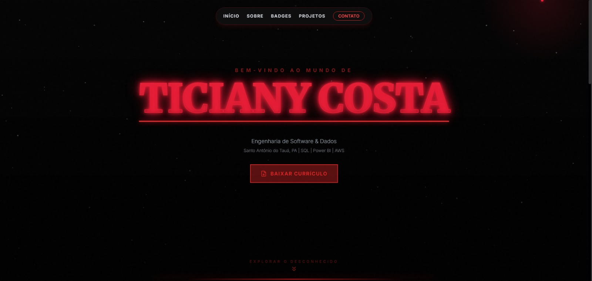

# Portfólio | Ticiany Costa

> "Explorar o Desconhecido"

Bem-vindo ao meu portfólio pessoal! Este projeto foi desenvolvido para apresentar minha trajetória, habilidades e projetos na área de **Engenharia de Software** e **Dados**. O design foi inspirado na temática "Mundo Invertido" (Stranger Things), trazendo uma identidade visual única e imersiva.



🔗 **Acesse o portfólio online:** [https://ticianycosta.github.io/](https://ticianycosta.github.io/)

---

## 👩‍💻 Sobre Mim

Sou graduanda em **Engenharia de Software** (Estácio, 2022–2026) e estou em transição de carreira para a área de **Dados**. Minha paixão é transformar dados brutos em insights valiosos, utilizando ferramentas de análise, automação e nuvem.

📍 **Localização:** Santo Antônio do Tauá, PA  
🚀 **Foco:** Dashboards, Visualização de Dados, ETL e Soluções em Nuvem (AWS).

---

## 🛠️ Tecnologias & Habilidades

O site foi construído utilizando **HTML5** e **CSS3** modernos, focado em responsividade e design criativo. Minhas competências técnicas incluem:

* **Análise de Dados:** Power BI, SQL, Python (Pandas)
* **Cloud & Infra:** AWS (Certified Cloud Practitioner)
* **Metodologias:** Scrum, Kanban
* **Segurança:** Noções de Cibersegurança

---

## 🏆 Certificações

* ☁️ **AWS Certified Cloud Practitioner** (Validado)
* 🎓 **AWS Re/Start Graduate** (Em andamento)
* 🛡️ **Cisco Introduction to Cybersecurity** (Validado)

---

## 📂 Projetos Destacados

No portfólio, você encontrará detalhes sobre projetos como:

1.  **🎮 Análise Valorant VCT 2024:** Solução *end-to-end* com ETL em Python e Dashboard no Power BI.
2.  **🎵 Spotify Data Analysis:** Banco de dados SQLite construído do zero com consultas SQL avançadas.
3.  **📊 Esports Analytics:** Simulação de dados e painéis táticos para esports.

---

## 🚀 Como executar este projeto localmente

Se você quiser clonar e visualizar este site no seu computador:

1.  **Clone o repositório:**
    ```bash
    git clone [https://github.com/TicianyCosta/TicianyCosta.github.io.git](https://github.com/TicianyCosta/TicianyCosta.github.io.git)
    ```

2.  **Acesse a pasta:**
    ```bash
    cd TicianyCosta.github.io
    ```

3.  **Abra o arquivo:**
    Basta abrir o arquivo `index.html` em qualquer navegador moderno (Chrome, Firefox, Edge).

---

## 📫 Contato

Sinta-se à vontade para entrar em contato para colaborações ou oportunidades!

* **GitHub:** [@TicianyCosta](https://github.com/TicianyCosta)
* **LinkedIn:** [Ticiany Costa](www.linkedin.com/in/ticiany-costa)

---

<p align="center">
  <i>© 2025 Ticiany Costa. Design feito no Mundo Invertido.</i>
</p>
